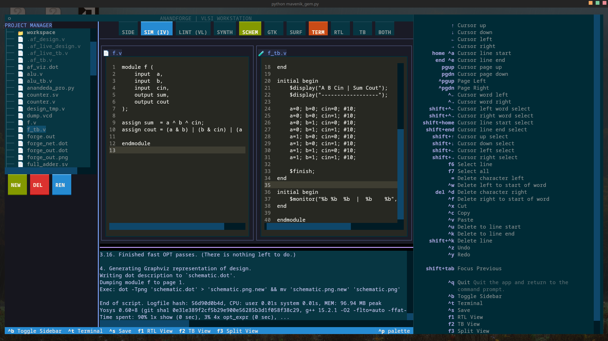
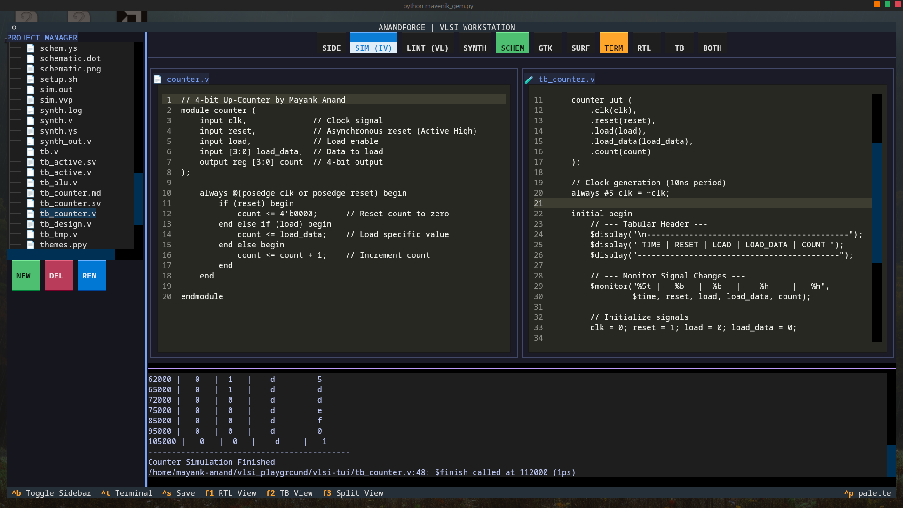
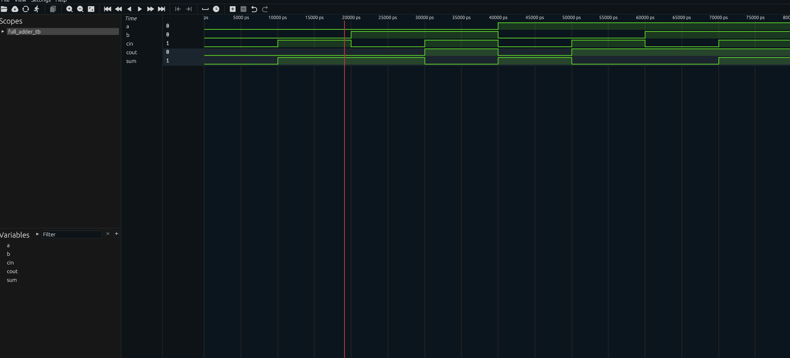
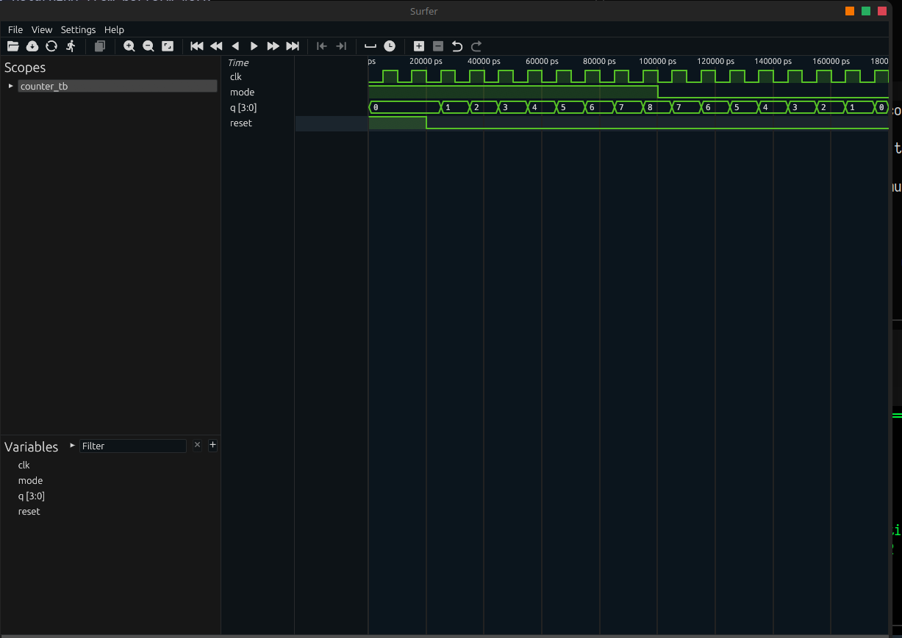
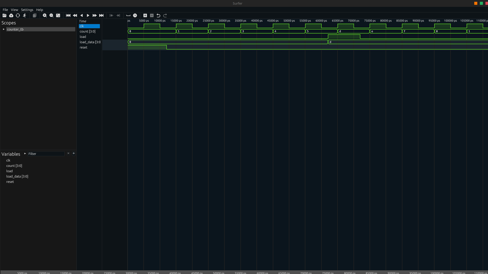
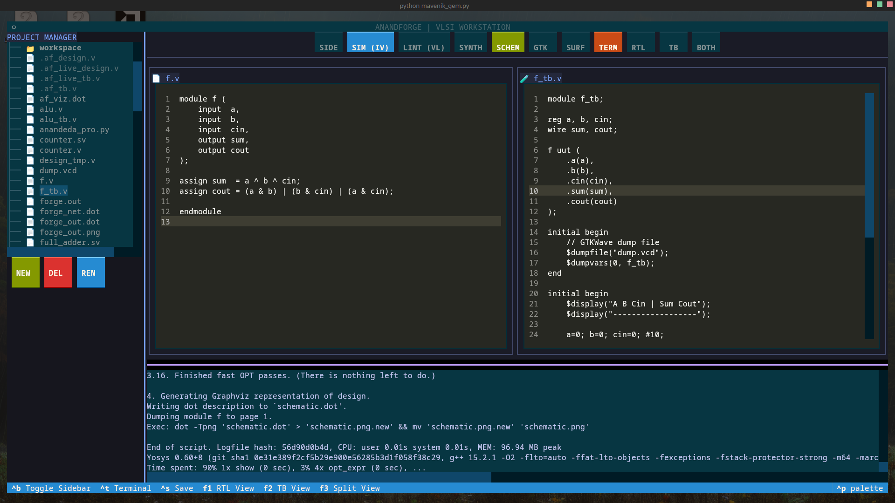
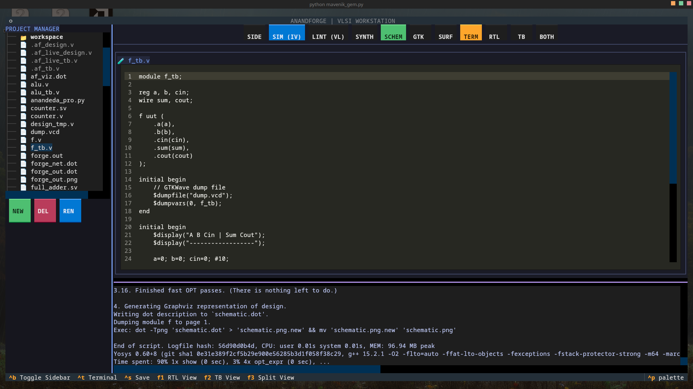
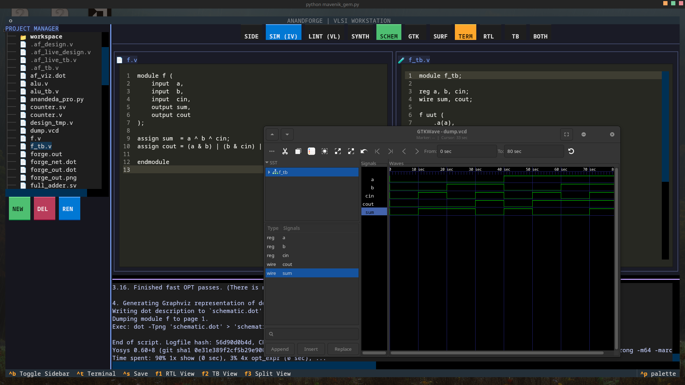

# 🛠️ AnandForge-TUI
**A Modular Terminal Workstation for VLSI Design & Verification**

[](LICENSE)
[](https://github.com/techanand8/anandforge-tui)
[](https://www.python.org/)
[](https://github.com/techanand8/anandforge-tui)

### 🏗️ Integrated EDA Tools
[](http://iverilog.icarus.com/)
[](https://yosyshq.net/yosys/)
[](http://gtkwave.sourceforge.net/)
[](https://www.veripool.org/verilator/)
[](https://github.com/surfer-project/surfer)

AnandForge-TUI is a high-performance terminal cockpit designed to bridge the gap between RTL coding and hardware verification. It unifies simulation, synthesis, and signal monitoring into a single, keyboard-driven interface.

---

## 🚀 Key Features

* **Integrated EDA Flow:** Execute **iVerilog** simulations and **Yosys** gate-level synthesis with a single keystroke.
* **Tabular Monitor System:** A custom verification dashboard that displays real-time signal states for components like 4-bit counters and full adders.
* **Zero-Switching Workflow:** Monitor synthesis logs and simulation results in side-by-side TUI panes.
* **Extensible Architecture:** Modular backend designed to scale. **Verilator** and **OpenROAD** integration coming soon.

## 🖥️ TUI Layout Preview

```text
+-------------------------------------------------------------+
| AnandForge-TUI v1.0                     [Status: Synthesis] |
+---------------------------+---------------------------------+
| [ File: counter_4bit.v ]  |      [ Tabular Monitor ]        |
|                           |                                 |
| 1: module counter(        |  TIME  | CLK | RST | EN | COUNT | |
| 2:   input clk, rst,      |  00ns  |  0  |  1  | 0  |  0000 | |
| 3:   output [3:0] out     |  10ns  |  1  |  0  | 1  |  0001 | |
| 4: );                     |  20ns  |  0  |  0  | 1  |  0001 | |
+---------------------------+---------------------------------+
| [ Log: Yosys Synthesis ]                                    |
|  Generating RTLIL representation for module `\counter'.     |
|  Finished mapping to gate-level cells.                      |
+-------------------------------------------------------------+
| [S] Synthesis  [V] Simulate  [M] Monitor  [Q] Quit          |
+-------------------------------------------------------------+
```

## 📂 Directory Structure

```text
anandforge-tui/
├── src/                # Core TUI logic and integration engines
├── examples/           # Pre-built VLSI designs (Counter, Adder)
├── scripts/            # Automation wrappers for Yosys/iVerilog
├── LICENSE             # MIT License
└── main.py             # Entry point
```

## 🛠️ Getting Started

### Prerequisites
Ensure you have **iVerilog** and **Yosys** installed in your `$PATH`.

### Installation
```bash
git clone https://github.com/techanand8/anandforge-tui.git
cd anandforge-tui
python3 mavenik_gem.py
```

## 📅 Roadmap
- [x] iVerilog & Yosys Integration
- [x] Tabular Signal Monitor
- [ ] **Verilator** High-Speed Simulation Support
- [ ] **GTKWave** TUI Overlay Integration
- [ ] ASCII Schematic Export
---

# 🛠️ AnandForge-TUI 
**High-Performance VLSI Workstation for the Terminal**

---

## 📺 Project Showcase (Latest Stable Build)
The current version features a robust **Tabular Monitor** for tracking logic transitions in real-time. This allows for cycle-by-cycle signal inspection of 4-bit counters and adders.

<p align="center">
  
  <br><i>Final Stable Release: Logic Verification Engine (Jan 3, 2026)</i>
</p>

---

## 🔍 Engineering & Synthesis Gallery

### ⚡ Yosys Gate-Level Synthesis
Integrating Yosys allows for real-time inspection of how Verilog code maps to hardware gates.
<p align="center">
  
  
</p>

### 📊 Logic Simulation & Tabular Monitor
Tracking `CLK`, `RST`, and `COUNT` signals across multiple design iterations.
<p align="center">
  
  
  
</p>

---

## 📂 Development Timeline (No Duplicates)

<details>
<summary><b>📷 Click to view the full build history</b></summary>

### Phase 3: UI Refinement & VCD Generation (Jan 2026)
| Build 14:46 | Build 14:44 | Build 14:39 |
| :---: | :---: | :---: |
|  |  |  |

### Phase 2: Core Logic Implementation (Jan 2026)
- **Signal Tracking:** `Screenshot_20260102_150441.png`, `Screenshot_20260102_143645.png`
- **Initial Verification:** `Screenshot_20260102_140711.png`, `Screenshot_20260103_113933.png`

### Phase 1: Prototype Birth (Dec 2025)
- **First TUI Frame:** `Screenshot_20251231_193449.png`
- **Original Workstation:** `Screenshot_20251230_165038.png`, `Screenshot_20251230_164956.png`

</details>

---

## 📺 Live Demo
Experience **AnandForge-TUI** in action with full audio. 

<p align="center">
  <video src="https://github.com/techanand8/anandforge-tui/raw/main/2026-01-03_20-19-43.mp4" width="100%" controls>
    Your browser does not support the video tag.
  </video>
</p>

---

## 🛠️ Integrated Tech Stack
* **Simulation:** iVerilog
* **Synthesis:** Yosys
* **Verification:** Custom Tabular Monitor
* **Future:** Verilator & Surfer TUI
---

## 🛠️ Easy Installation

AnandForge-TUI requires **iVerilog** and **Yosys** to function. 

### Step 1: Install System Engines
Copy the command for your Linux distribution:

| OS / Distro | Command |
| :--- | :--- |
| **Ubuntu / Debian** | `sudo apt update && sudo apt install iverilog yosys gtkwave -y` |
| **Fedora / RHEL** | `sudo dnf install iverilog yosys gtkwave` |
| **Arch / Manjaro** | `sudo pacman -S iverilog yosys gtkwave` |
| **macOS** | `brew install icarus-verilog yosys gtkwave` |

### Step 2: Install Python Requirements
Once the system tools are ready, run:
\`\`\`bash
pip install -r requirements.txt
\`\`\`

### Step 3: Launch
\`\`\`bash
python3 mavenik_gem.py
\`\`\`
---
Developed by [techanand8](https://github.com/techanand8)
